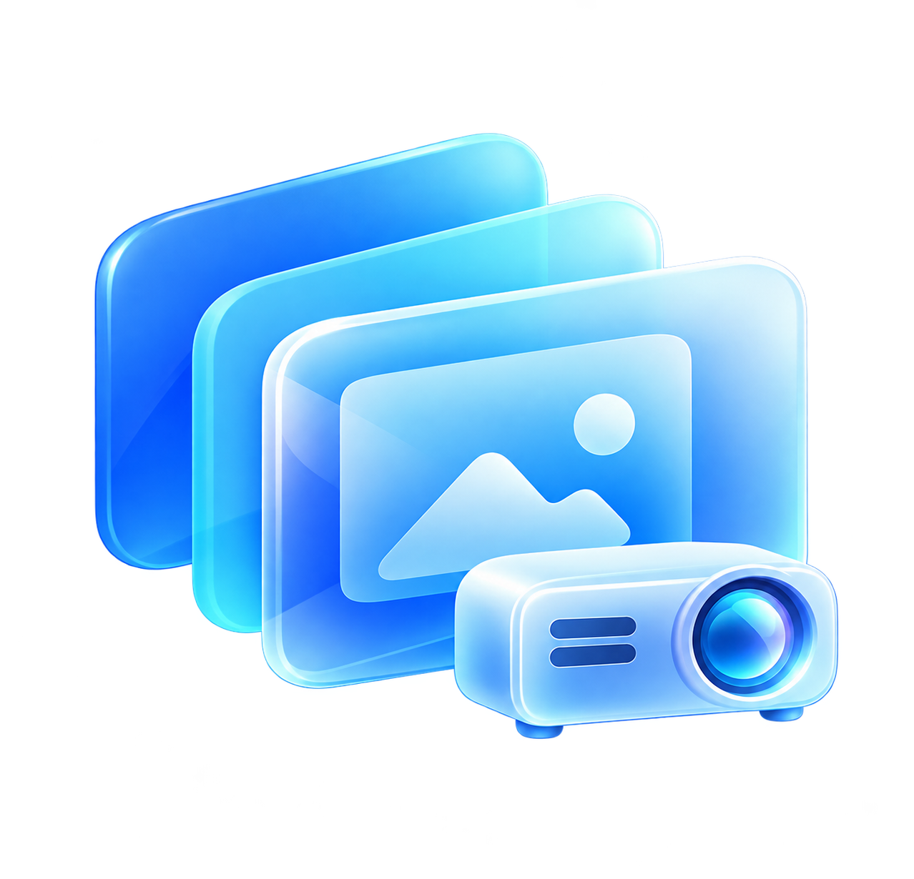
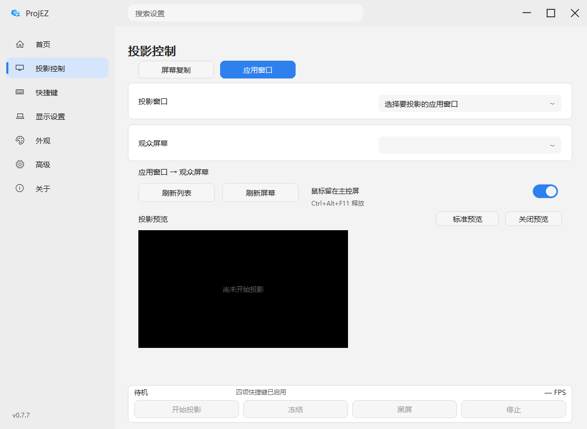
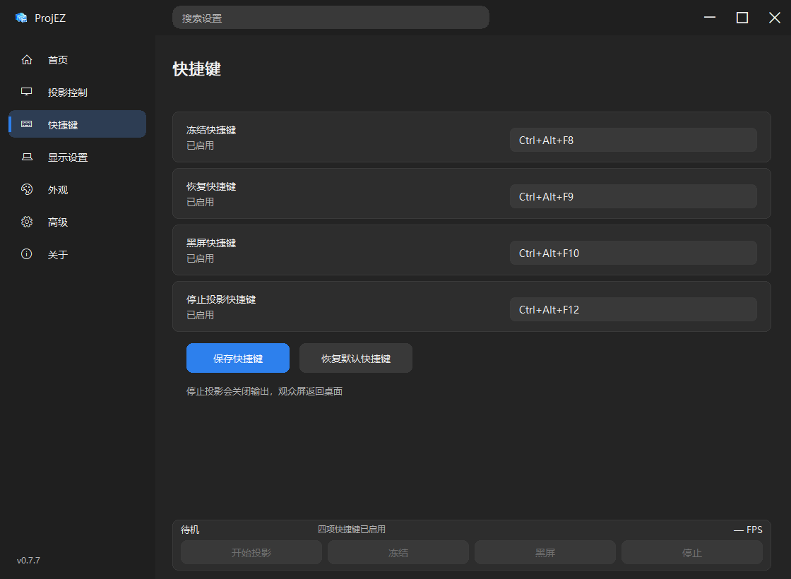

<div align="center">
  
  <h1>ProjEZ</h1>
  <p><strong>把画面留在投影上，把操作留在自己手里。</strong></p>
  <p>Windows 投影控制工具 · 主屏复制 · 应用窗口投影 · 冻结与黑屏</p>
  <p>
    
    
    
    <a href="LICENSE"></a>
  </p>
  <p><a href="https://github.com/wangmk23/ProjEZ/releases">下载</a> · <a href="#开始使用">开始使用</a> · <a href="docs/BUILD.md">构建</a> · <a href="docs/FAQ.md">常见问题</a> · <a href="README.en.md">English</a></p>
</div>

---

演示时，先让观众看到主屏或选定应用。需要找文件、切换软件时，冻结观众画面，本机继续操作；准备好后恢复同步。需要临时隐藏内容时，直接黑屏。

<p align="center"></p>

> 截图为不包含真实桌面内容的演示状态。实际投影需要连接第二块屏幕，并使用 Windows 扩展模式。

## 能做什么

| 投影 | 控制 | 设置 |
| --- | --- | --- |
| 完整复制主屏，保持画面比例 | 冻结画面，本机继续操作 | 四项快捷键直接按组合键录制 |
| 只投选定应用窗口 | 黑屏隐藏内容，手动恢复 | 识别显示器上报的品牌或型号 |
| 预览程序提交的观众画面 | 鼠标可限制在主控屏 | 深浅主题、缩放质量与帧率设置 |

采用 DirectX GPU 捕获与绘制；整屏模式在不支持时可使用 GDI 兼容路径。窗口捕获失败时保持黑屏，不回退为整个桌面。相同尺寸保留原像素，GPU 缩小采用面积加权，减少细线丢失。

## 开始使用

1. 从 [Releases](https://github.com/wangmk23/ProjEZ/releases) 下载 Windows x64 便携包，解压后运行 EXE。首次公开发布前，也可以按[构建说明](docs/BUILD.md)自行构建。
2. 连接投影仪或外接屏，按 **Win + P → 扩展**，把操作屏设为 Windows 主屏。
3. 首页点击 **复制主屏**；需要只投一个应用时，在 **投影控制 → 应用窗口** 中选择它和观众屏幕。
4. 用按钮或快捷键冻结、黑屏、恢复及停止。

**冻结**保留观众当前画面；**黑屏**临时隐藏内容。**停止**会关闭输出窗口，副屏返回 Windows 桌面。

## 快捷键

| 操作 | 默认快捷键 |
| --- | --- |
| 冻结画面 | `Ctrl + Alt + F8` |
| 恢复实时画面 | `Ctrl + Alt + F9` |
| 黑屏 | `Ctrl + Alt + F10` |
| 停止投影 | `Ctrl + Alt + F12` |
| 释放鼠标 | `Ctrl + Alt + F11` |

前四项可修改：点击快捷键框，直接按组合键，再保存检查。`Esc` 取消本次录制。录制期间暂停 ProjEZ 自己的全局快捷键，避免误触投影操作。运行新版前请退出旧实例，以免占用组合键。

<details>
<summary>查看快捷键页面</summary>



</details>

## 系统要求与边界

- Windows 10 1903 或更新版本、Windows 11，**x64**。只提供 Windows 桌面程序。
- 不要求独立显卡，实际帧率取决于设备、分辨率、驱动和捕获路径。普通办公笔记本可先选择 30 FPS 与节能预览。
- 分辨率不同会产生缩放；软件不能恢复低分辨率设备没有的细节。GDI 缩小仍使用系统缩放，不使用 GPU 面积加权算法。
- 应用窗口最小化、关闭或捕获失败后可能黑屏；还原后请停止并重新开始。
- 预览是程序提交画面的缩略图，不是投影幕布或显示器的回传。界面的 FPS 不等于显示器物理刷新率。
- 辅助隐私保护不能保证拦截全部通知。屏幕复制期间，主屏上的内容可能被观众看到。
- 程序未进行代码签名。安全软件可能提示，请核对下载来源及 SHA256；项目不会要求关闭安全防护。

## 开发与贡献

```powershell
go test ./... -count=1
go vet ./...
pwsh -File scripts/build.ps1
```

源码使用 Go 和 Windows 系统 API，无第三方运行时依赖。[构建与测试说明](docs/BUILD.md)包含硬件测试选项和发布包生成方法。

欢迎提交可复现的问题和 PR。报告画质或性能问题时，请提供两端分辨率、GPU/GDI 后端与复现步骤，并遮盖私人窗口标题和桌面内容。见 [贡献指南](CONTRIBUTING.md)与[隐私说明](docs/PRIVACY.md)。

## 许可证与致谢

采用 [MIT License](LICENSE)。Windows 图标资源生成使用 [akavel/rsrc](https://github.com/akavel/rsrc)，仅在构建时需要。其他构建工具说明见 [THIRD_PARTY_NOTICES.md](THIRD_PARTY_NOTICES.md)。
